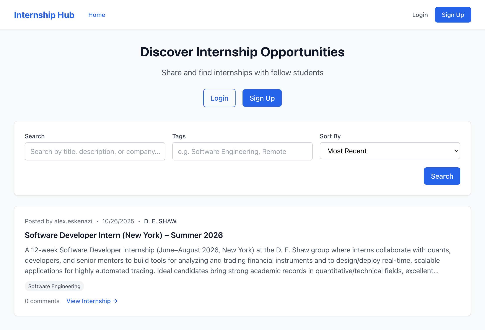
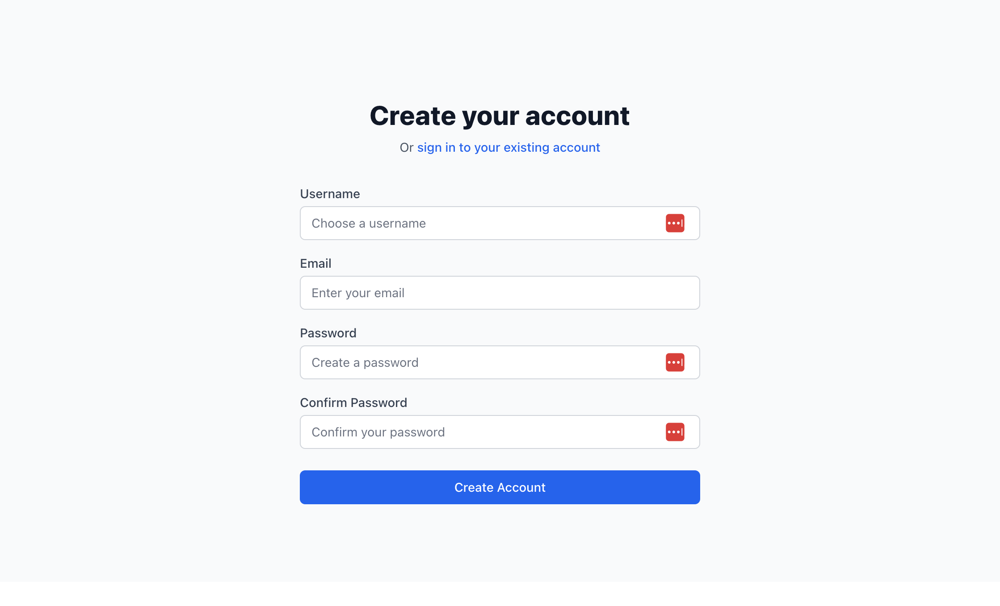
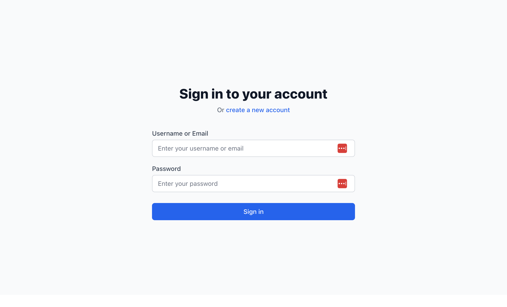
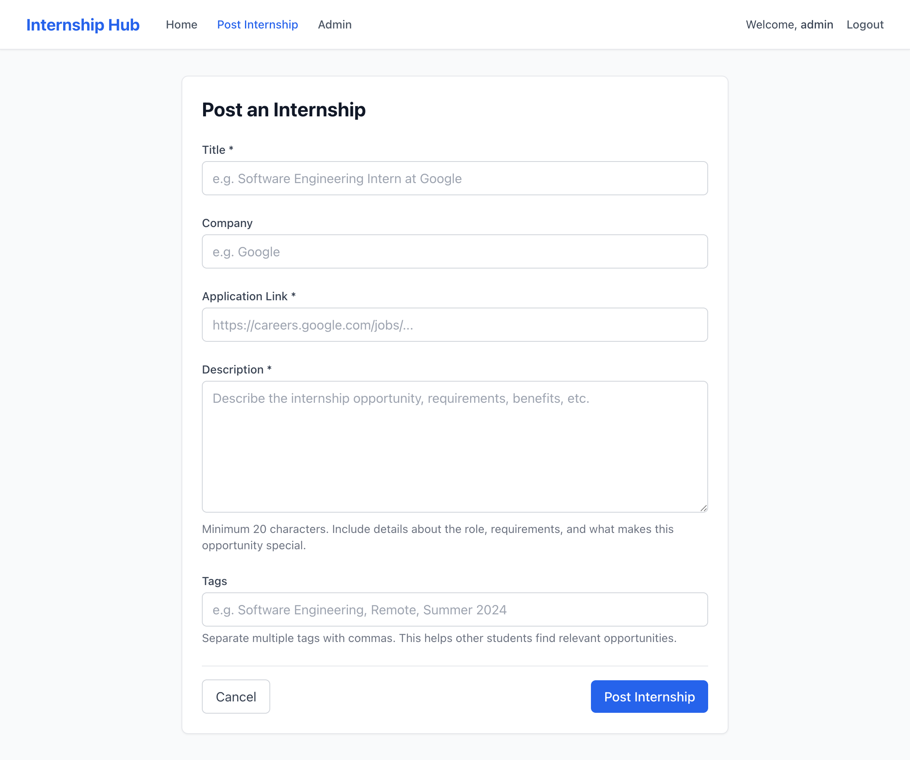
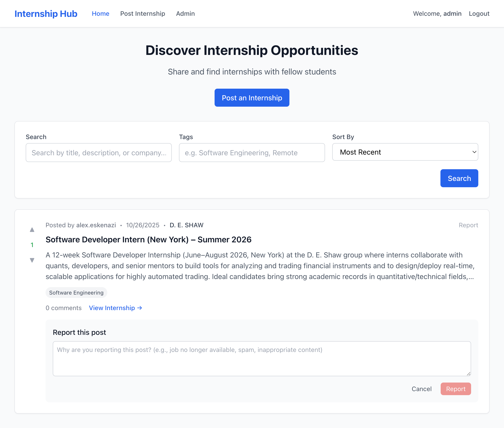
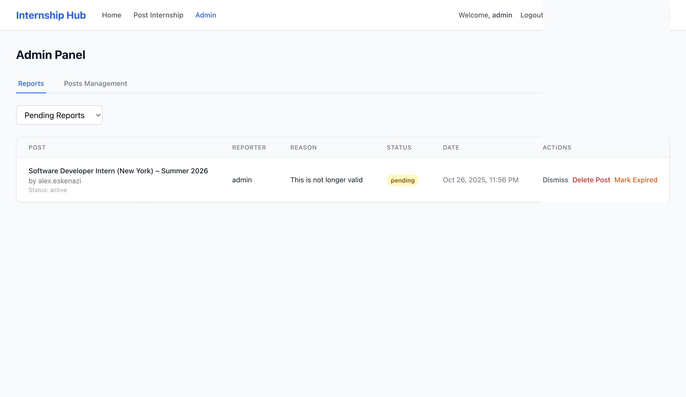
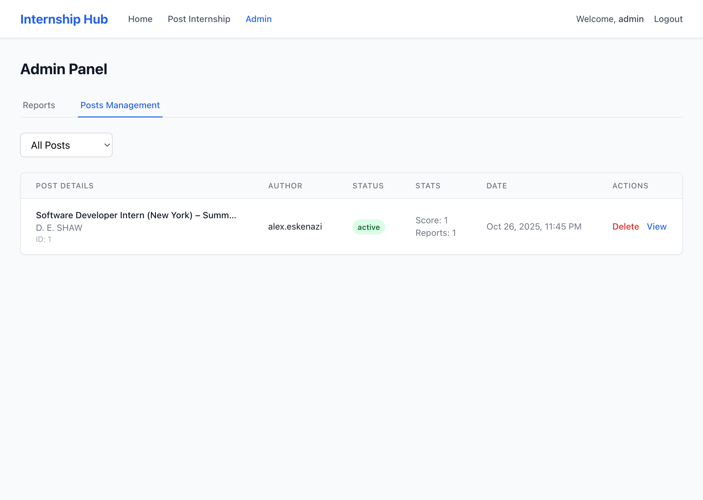

# Software Requirements Specification – Internship Hub

**Version:** 1.5
**Date:** November 10, 2025
**Authors:** Alex Eskenazi, Vaughn Stout, Vishil Patel

## Team Roles

**Alex Eskenazi - Front-End Lead**
- GUI and Controller development
- UI Design and user interactions
- UX (user experience design)
- Front-end functionality implementation
- Functional Tests

**Vaughn Stout - Software Lead**
- Overall code quality oversight
- Ensures application meets user requirements
- All documentation: SRS, README, Docstrings
- Integration tests
- Testing Coverage

**Vishil Patel - Back-End Lead**
- Database design and implementation
- Data persistence and services
- Models and data API classes
- Back-end logic development
- Unit Tests

## Document History
- v1.0 - Initial requirements (September 29, 2025)
- v1.1 - Database and backend requirements added (October 6, 2025)
- v1.2 - Software architecture diagrams added (October 6, 2025)
- v1.3 - Team roles and testing requirements added (October 13, 2025)
- v1.4 - User stories section added with epics and requirements mapping (November 3, 2025)
- v1.5 - Project status section added with known bugs, missing features, and Phase 2 plans (November 10, 2025)

---

## Requirements

### What Users Can Do

• Students can sign up and log in to their accounts

• Different user roles: guest, regular user, moderator, and admin with appropriate permissions

• Secure login system with password protection and session management

• Users can create posts with a title, description, company link, and tags

• Users can edit or delete their own posts anytime

• All internships show up in a clean, scrollable list with sorting options

• Users can add comments under any internship post

• Users can see who commented and when, with ability to edit/delete their own comments

• Users can upvote or downvote internship posts (no double voting)

• Posts with higher ratings appear first in the feed

• Search functionality by keywords with real-time results

• Filter posts by tags (Software Engineering, Remote, etc.)

• Combine multiple filters for advanced searching capabilities

• Moderators can approve posts before they go public

• Users can flag bad or outdated posts for review

• Admins can manage users and content with full control permissions

### Technical Stuff

• Fully responsive design that works on both mobile and desktop devices

• Fast and stable database backend with optimized queries

• Focused on security and reliability with proper data validation

• Simple, user-friendly interface that's easy to navigate

## User Stories

User stories help us figure out what users actually need and why they need it. We're using the format from class: "As a [type of user], I want [goal] so that [reason]."

### Epic 1: Account Management and Authentication

**User Story 1.1: User Registration**
- As a student, I want to create an account with a username and password so that I can start posting and interacting with internship opportunities
- Related Requirements: Students can sign up and log in to their accounts, Secure login system with password protection

**User Story 1.2: User Login**
- As a returning user, I want to log in with my credentials so that I can access my account and previous posts
- Related Requirements: Students can sign up and log in to their accounts, Secure login system with password protection

**User Story 1.3: Role-Based Access**
- As an admin, I want different permission levels for users so that I can control who can moderate content
- Related Requirements: Different user roles: guest, regular user, moderator, and admin with appropriate permissions

### Epic 2: Internship Posting and Management

**User Story 2.1: Create Internship Post**
- As a student, I want to post internship opportunities with all the details so that I can share valuable opportunities with other students
- Related Requirements: Users can create posts with a title, description, company link, and tags

**User Story 2.2: Edit Own Posts**
- As a user, I want to edit my own posts so that I can fix typos or update information that changed
- Related Requirements: Users can edit or delete their own posts anytime

**User Story 2.3: Delete Own Posts**
- As a user, I want to delete posts I created so that I can remove opportunities that are no longer available
- Related Requirements: Users can edit or delete their own posts anytime

**User Story 2.4: View All Posts**
- As a student, I want to see all available internships in a scrollable list so that I can browse through opportunities easily
- Related Requirements: All internships show up in a clean, scrollable list with sorting options

### Epic 3: Community Interaction

**User Story 3.1: Add Comments**
- As a user, I want to comment on internship posts so that I can ask questions or share my experience with that company
- Related Requirements: Users can add comments under any internship post

**User Story 3.2: View Comments**
- As a student browsing posts, I want to see all comments and who wrote them so that I can learn from others' experiences
- Related Requirements: Users can see who commented and when, with ability to edit/delete their own comments

**User Story 3.3: Edit/Delete Own Comments**
- As a commenter, I want to edit or delete my comments so that I can correct mistakes or remove comments I no longer want visible
- Related Requirements: Users can see who commented and when, with ability to edit/delete their own comments

**User Story 3.4: Upvote Posts**
- As a student, I want to upvote helpful internship posts so that good opportunities rise to the top for everyone
- Related Requirements: Users can upvote or downvote internship posts (no double voting), Posts with higher ratings appear first

**User Story 3.5: Downvote Posts**
- As a user, I want to downvote unhelpful or suspicious posts so that low-quality content doesn't waste others' time
- Related Requirements: Users can upvote or downvote internship posts (no double voting), Posts with higher ratings appear first

### Epic 4: Search

**User Story 4.1: Keyword Search**
- As a student looking for specific opportunities, I want to search by keywords like company names or job titles so that I can quickly find relevant internships
- Related Requirements: Search functionality by keywords with real-time results

**User Story 4.2: Filter by Tags**
- As a user, I want to filter posts by tags like "Remote" or "Software Engineering" so that I only see internships that match my interests
- Related Requirements: Filter posts by tags (Software Engineering, Remote, etc.)

**User Story 4.3: Advanced Filtering**
- As a student with specific criteria, I want to combine multiple filters so that I can narrow down to exactly what I'm looking for
- Related Requirements: Combine multiple filters for advanced searching capabilities

### Epic 5: Administration

**User Story 5.1: Report Bad Posts**
- As a user, I want to flag inappropriate or outdated posts so that admins can review and remove them
- Related Requirements: Users can flag bad or outdated posts for review

**User Story 5.2: Review Reports**
- As an admin, I want to see all reported posts in one place so that I can efficiently moderate content
- Related Requirements: Admins can manage users and content with full control permissions

**User Story 5.3: Delete/Restore Posts**
- As an admin, I want to delete posts that violate guidelines or restore falsely deleted posts so that the platform stays clean and fair
- Related Requirements: Admins can manage users and content with full control permissions

**User Story 5.4: Approve Posts (Future)**
- As a moderator, I want to approve posts before they go live so that we can prevent spam from appearing on the site
- Related Requirements: Moderators can approve posts before they go public
- Note: We haven't implemented this yet, might add it later if we have time

### Epic 6: User Experience and Accessibility

**User Story 6.1: Mobile Access**
- As a student on my phone, I want the app to work well on mobile so that I can browse internships anywhere
- Related Requirements: Fully responsive design that works on both mobile and desktop devices

**User Story 6.2: Fast Performance**
- As any user, I want pages to load quickly so that I don't waste time waiting
- Related Requirements: Fast and stable database backend with optimized queries

**User Story 6.3: Intuitive Interface**
- As a new user, I want the interface to be easy to understand so that I can start using the app without confusion
- Related Requirements: Simple, user-friendly interface that's easy to navigate

## Software Architecture Diagram

### Application Architecture Diagram

Our Internship Hub application follows a standard three-tier web architecture:

**Component Interactions:**
- Frontend communicates with Backend via RESTful API calls
- Backend handles business logic and database operations
- Database stores persistent data using SQLAlchemy ORM
- Authentication flows through all layers for secure access

### Backend Container Class Diagram

Our Flask backend container includes the following classes and their relationships:

**Relationship Legend:**
- **Inheritance**: Not used in our current model design
- **Bidirectional Association** (◄──►): Post ↔ Comment (posts have comments, comments belong to posts)
- **Unidirectional Association** (──►): User → Post, User → Comment, User → Vote, User → Report (users create posts/comments/votes/reports, but posts don't directly reference users beyond foreign key)

**Key Relationships:**
- User has many Posts, Comments, Votes, and Reports (1:many)
- Post has many Comments, Votes, and Reports (1:many)
- Comments and Votes belong to both User and Post (many:1)
- Reports can be filed against Posts by Users (many:1)

## Account Features

Students can sign up and log in to their accounts

Different roles: guest, regular user, moderator, and admin

Secure login system with password protection

## Creating posts

Users can create posts with a title, description, company link, and tags

You can edit or delete your own posts anytime

All internships show up in a clean, scrollable list

## Commenting features

Add comments under any internship post

See who commented and when

Edit or delete your own comments

Comments appear instantly (no refresh needed)

## Voting features

Upvote or downvote internship posts

No double voting on the same post

Posts with higher ratings appear first

## Search features

Search by keywords

Filter by tags (like Software Engineering, Remote, etc.)

Combine multiple filters for advanced searching

Results load quickly and feel responsive

## Moderation

Moderators approve posts before they go public

Users can flag bad or outdated posts

Admins can manage users and content

Each role has its own permissions and controls

## Technical Details

Fully responsive (works on both mobile and desktop)

Fast and stable database backend

Focused on security and reliability

Simple, user-friendly interface

## User Interface

We built a bunch of different screens for the Internship Hub app. Everything works on phones and computers. Here's what each screen does:

### Main App Screens

#### Home Page
This is where people go to look for internships.

What's on this page:
- Search box to find specific jobs or companies
- Filter buttons for tags like "Remote" or "Software"
- Sort by newest posts or most popular ones
- Each internship shows up as a card with upvote/downvote buttons
- Page numbers at the bottom to see more posts
- Header with login button or user menu

What users do:
- Type in the search box to find internships
- Click upvote or downvote on posts
- Click on a post to see more details
- Use the login/signup buttons

#### Sign Up Page
Where new users make accounts.

What's on this page:
- Username box
- Email box  
- Password box
- Confirm password box
- Error messages if something's wrong
- Link to login page if you already have an account

What users do:
- Fill out all the boxes
- Click sign up button
- Go to login page if they already have an account

#### Login Page
Where existing users sign in.

What's on this page:
- Username or email box
- Password box
- Error message if login fails
- Link to sign up page
- Pretty simple layout

What users do:
- Type their username and password
- Click login button
- Go to sign up if they need to make an account

#### Post Internship Page
Where users share job opportunities.

What's on this page:
- Title field (required)
- Company name field (optional)
- Description box (required)
- Link to apply field (required)
- Tags field (optional)
- Error messages if fields are missing
- Submit and cancel buttons

What users do:
- Fill out the internship info
- Add tags to help people find it
- Submit to post it
- Cancel to go back

#### Report Post Feature
Users can flag bad posts.

What's on this page:
- Text box to explain why they're reporting
- Submit and cancel buttons
- Simple popup form

What users do:
- Write why the post is bad (expired, spam, etc.)
- Submit the report
- Cancel if they change their mind

### Admin Screens

#### Admin Reports Page
Where admins handle user reports.

What's on this page:
- Table showing all the reports
- Info about each post and who reported it
- Buttons to dismiss, delete post, or mark expired
- Filter to show pending or resolved reports

What admins do:
- Look at reported posts
- Decide if reports are valid
- Delete bad posts or dismiss false reports
- Keep track of what they've reviewed

#### Admin Posts Page
Where admins manage all posts.

What's on this page:
- List of all posts in the system
- Shows if posts are active, deleted, or expired
- Post info like title, author, vote score
- Delete/restore buttons
- Filter to show different types of posts

What admins do:
- Delete inappropriate posts
- Restore posts that were deleted by mistake
- See how many reports each post has
- Filter to find specific posts

### How We Designed Everything

Basic stuff we tried to keep the same:
- Same navigation bar on every page
- Buttons look the same everywhere
- Forms work the same way

Making it usable:
- Big enough text that's easy to read
- Good color contrast
- Works with keyboard navigation
- Screen readers can use it

Works on different devices:
- Mobile phones and tablets work fine
- Layout adjusts to screen size
- Buttons are big enough to tap on phones

User experience stuff:
- Easy to figure out how to use
- Shows error messages that actually help
- Don't have to click through tons of pages
- Gives feedback when you do something

## Project Status

### Known Bugs

1) **Title:** Hardcoded Secret Key in Source Code
   - description: The Flask secret key is hardcoded directly in app.py instead of using an environment variable. This is a security risk because anyone with access to the code can see the secret key, which could let them fake user sessions.
   - nature: security
   - severity: critical
   - priority: P1

2) **Title:** Weak Password Requirements
   - description: Passwords only need to be 6 characters long with no other requirements. There's no check for uppercase letters, numbers, or special characters, which makes accounts easier to hack.
   - nature: security
   - severity: high
   - priority: P1

3) **Title:** Can't Edit Posts from the UI
   - description: The backend API has the code to edit posts, but there's no edit button or form on the frontend. Users can't actually edit their posts even though the database supports it.
   - nature: functional
   - severity: medium
   - priority: P2

4) **Title:** Can't Edit Comments from the UI
   - description: Same problem as with posts - the backend works, but there's no way to edit a comment from the website. You'd have to delete and repost if you made a typo.
   - nature: functional
   - severity: medium
   - priority: P2

5) **Title:** Using Alert Popups Instead of Nice Notifications
   - description: The app uses browser alert() popups for messages, which look bad and interrupt what you're doing. Should use toast notifications or inline messages instead.
   - nature: UI/UX
   - severity: low
   - priority: P2

6) **Title:** Tags Data Type Confusion
   - description: Tags are stored as a comma-separated string in the database but sometimes the frontend treats them like an array. This causes bugs when trying to display or filter tags.
   - nature: functional
   - severity: medium
   - priority: P2

7) **Title:** Generic Error Messages
   - description: When something goes wrong, the app just says "Failed to create post" or similar generic messages. It doesn't tell you what actually went wrong, which makes it hard to fix problems.
   - nature: UI/UX
   - severity: low
   - priority: P3

### Critical Non-Implemented Features

1) **Feature:** Post Moderation/Approval System
   - description: The SRS says moderators should be able to approve posts before they go public, but this isn't implemented at all. Right now all posts go live immediately. The database has an 'approved' field but it's always set to true automatically.
   - priority: P1

2) **Feature:** Password Reset/Recovery
   - description: If users forget their password, there's no way to reset it. They'd be locked out of their account permanently. We need to add a "Forgot Password" link and email system.
   - priority: P1

3) **Feature:** User Profile Management
   - description: Users can't update their email, change their password, or edit any profile information after signing up. There's no profile page at all.
   - priority: P2

### Phase 2 Features (planned)

1) **Planned Feature:** Email Notifications
   - description: Send email alerts when someone comments on your post, when your post gets upvoted, or when an admin reviews a report you filed.
   - Note: we may not be able do do this for free as the email sending services cost some money.

## Testing

We need to test all the backend and frontend stuff to make sure it works. Here's what we plan to test:

### Backend Model Tests
- **User Model**
  - test_create_user(user_data)
    - method tested: User.__init__(self, username, email, password, role)
    - Tests user creation with valid data and proper password hashing
  - test_user_authentication(login_data)
    - method tested: User.check_password(self, password)
    - Verifies password verification works correctly
  - test_user_roles(role_data)
    - method tested: User.has_permission(self, action)
    - Tests role-based permissions for different user types

- **Post Model**
  - test_create_post(post_data)
    - method tested: Post.__init__(self, title, description, company, link, tags, user_id)
    - Tests internship post creation with all required fields
  - test_post_validation(invalid_data)
    - method tested: Post.validate(self)
    - Ensures posts meet minimum requirements before saving
  - test_post_search(search_terms)
    - method tested: Post.search(query, filters)
    - Tests search functionality with keywords and tag filters

- **Comment Model**  
  - test_add_comment(comment_data)
    - method tested: Comment.__init__(self, content, user_id, post_id)
    - Tests comment creation and association with posts
  - test_comment_permissions(user_data)
    - method tested: Comment.can_edit(self, user)
    - Verifies users can only edit their own comments

- **Vote Model**
  - test_upvote_post(vote_data)
    - method tested: Vote.create(self, user_id, post_id, vote_type)
    - Tests upvoting functionality and prevents duplicate votes
  - test_vote_calculations(post_data)
    - method tested: Post.calculate_score(self)
    - Tests vote tallying and post ranking algorithms

- **Report Model**
  - test_report_post(report_data)
    - method tested: Report.__init__(self, user_id, post_id, reason)
    - Tests reporting functionality for inappropriate content
  - test_report_review(moderator_data)
    - method tested: Report.review(self, moderator, decision)
    - Tests moderation workflow for reported content

### API Endpoint Tests
- **Authentication API**
  - test_user_registration(registration_data)
    - endpoint tested: POST /api/auth/register
    - Tests user registration with validation and error handling
  - test_user_login(login_data)
    - endpoint tested: POST /api/auth/login
    - Tests authentication and session creation

- **Posts API**
  - test_get_posts(request_data)
    - endpoint tested: GET /api/posts
    - Tests retrieving posts with pagination and filtering
  - test_create_post(post_data)
    - endpoint tested: POST /api/posts
    - Tests post creation with authentication required

- **Comments API**
  - test_post_comments(comment_data)
    - endpoint tested: POST /api/posts/{id}/comments
    - Tests adding comments to posts with proper validation

- **Search API**
  - test_search_functionality(search_data)
    - endpoint tested: GET /api/search
    - Tests search with various filters and sorting options
