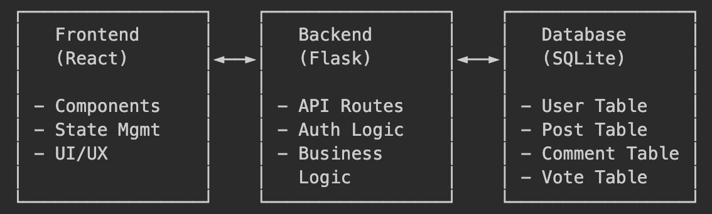
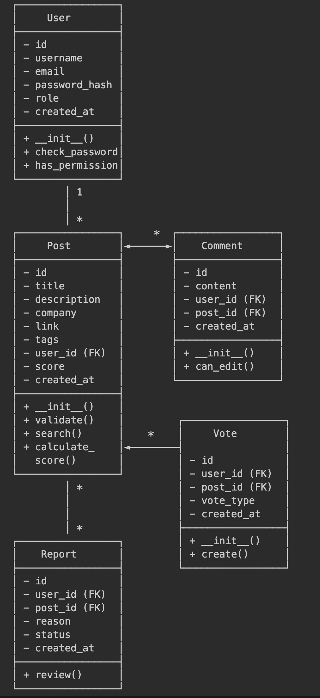

# Software Requirements Specification – Internship Hub

**Version:** 1.3  
**Date:** October 13, 2025  
**Authors:** Alex Eskenazi, Vaughn Stout, Vishil Patel

## Team Roles

**Alex Eskenazi - Front-End Lead**
- GUI and Controller development
- UI Design and user interactions  
- UX (user experience design)
- Front-end functionality implementation
- Functional Tests

**Vaughn Stout - Software Lead**
- Overall code quality oversight
- Ensures application meets user requirements
- All documentation: SRS, README, Docstrings
- Acceptance Test Procedures
- Integration tests
- Testing Coverage

**Vishil Patel - Back-End Lead**
- Database design and implementation
- Data persistence and services
- Models and data API classes  
- Back-end logic development
- Unit Tests

## Document History
- v1.0 - Initial requirements (September 29, 2025)
- v1.1 - Database and backend requirements added (October 6, 2025) 
- v1.2 - Software architecture diagrams added (October 6, 2025)
- v1.3 - Team roles and testing requirements added (October 13, 2025)

---

## Requirements

### What Users Can Do

• Students can sign up and log in to their accounts

• Different user roles: guest, regular user, moderator, and admin with appropriate permissions

• Secure login system with password protection and session management

• Users can create posts with a title, description, company link, and tags

• Users can edit or delete their own posts anytime

• All internships show up in a clean, scrollable list with sorting options

• Users can add comments under any internship post

• Users can see who commented and when, with ability to edit/delete their own comments

• Users can upvote or downvote internship posts (no double voting)

• Posts with higher ratings appear first in the feed

• Search functionality by keywords with real-time results

• Filter posts by tags (Software Engineering, Remote, etc.)

• Combine multiple filters for advanced searching capabilities

• Moderators can approve posts before they go public

• Users can flag bad or outdated posts for review

• Admins can manage users and content with full control permissions

### Technical Stuff

• Fully responsive design that works on both mobile and desktop devices

• Fast and stable database backend with optimized queries

• Focused on security and reliability with proper data validation

• Simple, user-friendly interface that's easy to navigate

## Software Architecture Diagram

### Application Architecture Diagram

Our Internship Hub application follows a standard three-tier web architecture:

**Component Interactions:**
- Frontend communicates with Backend via RESTful API calls
- Backend handles business logic and database operations
- Database stores persistent data using SQLAlchemy ORM
- Authentication flows through all layers for secure access

### Backend Container Class Diagram

Our Flask backend container includes the following classes and their relationships:

**Relationship Legend:**
- **Inheritance**: Not used in our current model design
- **Bidirectional Association** (◄──►): Post ↔ Comment (posts have comments, comments belong to posts)
- **Unidirectional Association** (──►): User → Post, User → Comment, User → Vote, User → Report (users create posts/comments/votes/reports, but posts don't directly reference users beyond foreign key)

**Key Relationships:**
- User has many Posts, Comments, Votes, and Reports (1:many)
- Post has many Comments, Votes, and Reports (1:many)
- Comments and Votes belong to both User and Post (many:1)
- Reports can be filed against Posts by Users (many:1)

## Account Features

Students can sign up and log in to their accounts

Different roles: guest, regular user, moderator, and admin

Secure login system with password protection

## Creating posts

Users can create posts with a title, description, company link, and tags

You can edit or delete your own posts anytime

All internships show up in a clean, scrollable list

## Commenting features

Add comments under any internship post

See who commented and when

Edit or delete your own comments

Comments appear instantly (no refresh needed)

## Voting features

Upvote or downvote internship posts

No double voting on the same post

Posts with higher ratings appear first

## Search features

Search by keywords

Filter by tags (like Software Engineering, Remote, etc.)

Combine multiple filters for advanced searching

Results load quickly and feel responsive

## Moderation

Moderators approve posts before they go public

Users can flag bad or outdated posts

Admins can manage users and content

Each role has its own permissions and controls

## Technical Details

Fully responsive (works on both mobile and desktop)

Fast and stable database backend

Focused on security and reliability

Simple, user-friendly interface

## Testing

### Backend Model Tests
- **User Model**
  - test_create_user(user_data)
    - method tested: User.__init__(self, username, email, password, role)
    - Tests user creation with valid data and proper password hashing
  - test_user_authentication(login_data)
    - method tested: User.check_password(self, password)
    - Verifies password verification works correctly
  - test_user_roles(role_data)
    - method tested: User.has_permission(self, action)
    - Tests role-based permissions for different user types

- **Post Model**
  - test_create_post(post_data)
    - method tested: Post.__init__(self, title, description, company, link, tags, user_id)
    - Tests internship post creation with all required fields
  - test_post_validation(invalid_data)
    - method tested: Post.validate(self)
    - Ensures posts meet minimum requirements before saving
  - test_post_search(search_terms)
    - method tested: Post.search(query, filters)
    - Tests search functionality with keywords and tag filters

- **Comment Model**  
  - test_add_comment(comment_data)
    - method tested: Comment.__init__(self, content, user_id, post_id)
    - Tests comment creation and association with posts
  - test_comment_permissions(user_data)
    - method tested: Comment.can_edit(self, user)
    - Verifies users can only edit their own comments

- **Vote Model**
  - test_upvote_post(vote_data)
    - method tested: Vote.create(self, user_id, post_id, vote_type)
    - Tests upvoting functionality and prevents duplicate votes
  - test_vote_calculations(post_data)
    - method tested: Post.calculate_score(self)
    - Tests vote tallying and post ranking algorithms

- **Report Model**
  - test_report_post(report_data)
    - method tested: Report.__init__(self, user_id, post_id, reason)
    - Tests reporting functionality for inappropriate content
  - test_report_review(moderator_data)
    - method tested: Report.review(self, moderator, decision)
    - Tests moderation workflow for reported content

### API Endpoint Tests
- **Authentication API**
  - test_user_registration(registration_data)
    - endpoint tested: POST /api/auth/register
    - Tests user registration with validation and error handling
  - test_user_login(login_data)
    - endpoint tested: POST /api/auth/login
    - Tests authentication and session creation

- **Posts API**
  - test_get_posts(request_data)
    - endpoint tested: GET /api/posts
    - Tests retrieving posts with pagination and filtering
  - test_create_post(post_data)
    - endpoint tested: POST /api/posts
    - Tests post creation with authentication required

- **Comments API**
  - test_post_comments(comment_data)
    - endpoint tested: POST /api/posts/{id}/comments
    - Tests adding comments to posts with proper validation

- **Search API**
  - test_search_functionality(search_data)
    - endpoint tested: GET /api/search
    - Tests search with various filters and sorting options
